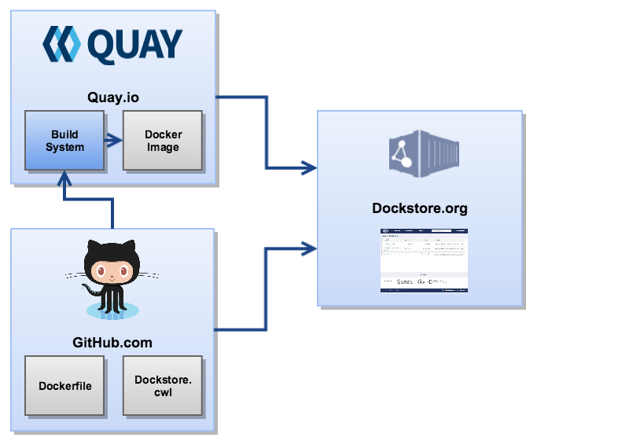
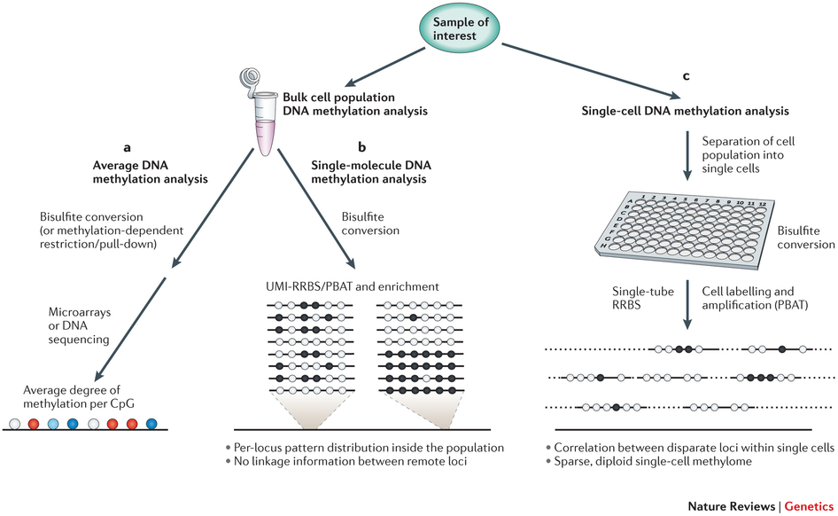
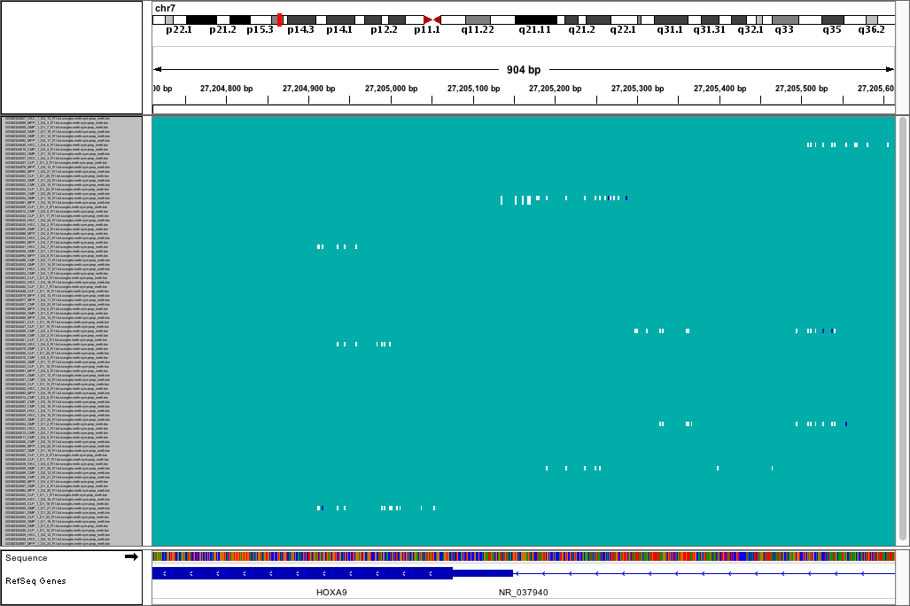

## Reproducible Research 

Reproducible research requires having the exact **data**, **code** and **software** used to perform an analysis.

Image from dockstore.org, used under Apache-2.0

## Single-cell Whole Genome Bisulfite Seq 

Schwartzman et al (2015) Nature Reviews in Genetics (used by permission) 

## Single-cell Whole Genome Bisulfite Seq Data

## Preprocessing: Example problem -- lack of standards!

## Output: Distance matrix and clustering

## Status and Plans

- So far we just have one example data set, with some basic preprocessing and heatmap generation. 

- But about half a dozen SC-WGBS (or SC-RRBS) public data sets now exist.
- We intend to use Screw to perform a meta-analysis of these.
- More vis, more tools, differential methylation calling.

## Acknowledgements

**NCBI Genomics Hackathon**: Benjamin Decato, Alexander Goncearenco, Azhar Khandekhar, Ben Busby (hackathon organiser)

**Summer intern**: Chelsey Fang

`https://github.com/Epigenomics-Screw`
Poster: A-153 (Sunday 6pm)
